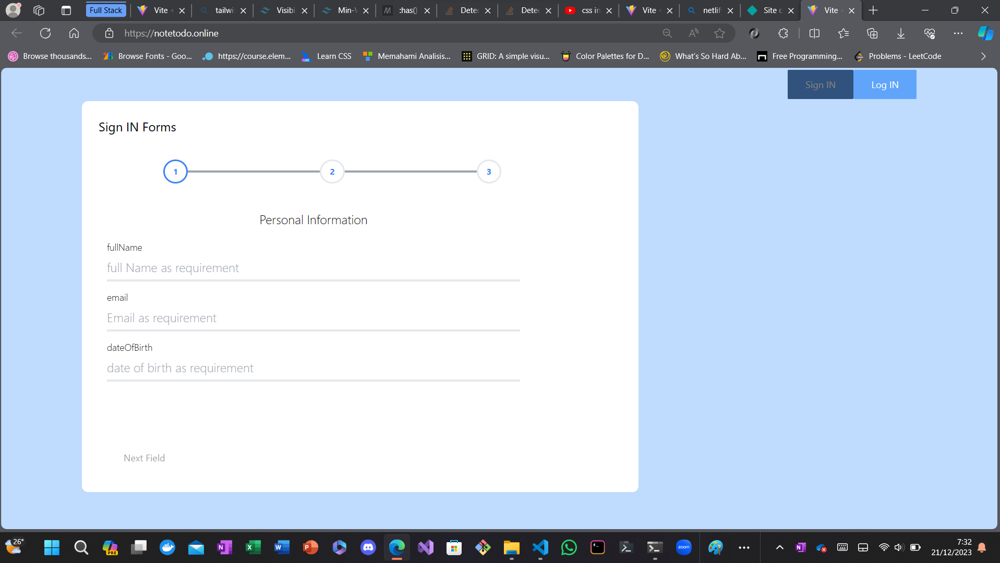
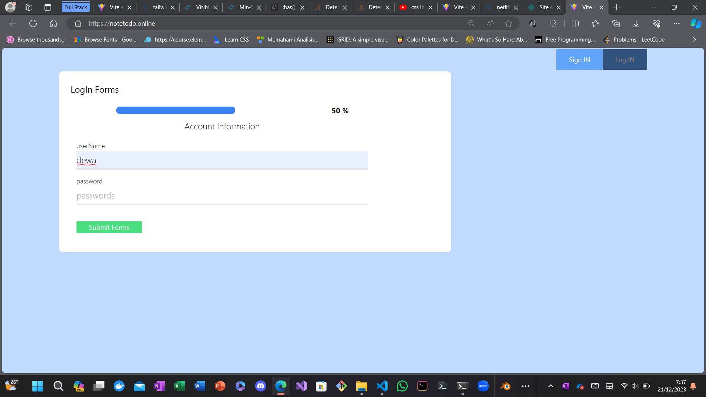
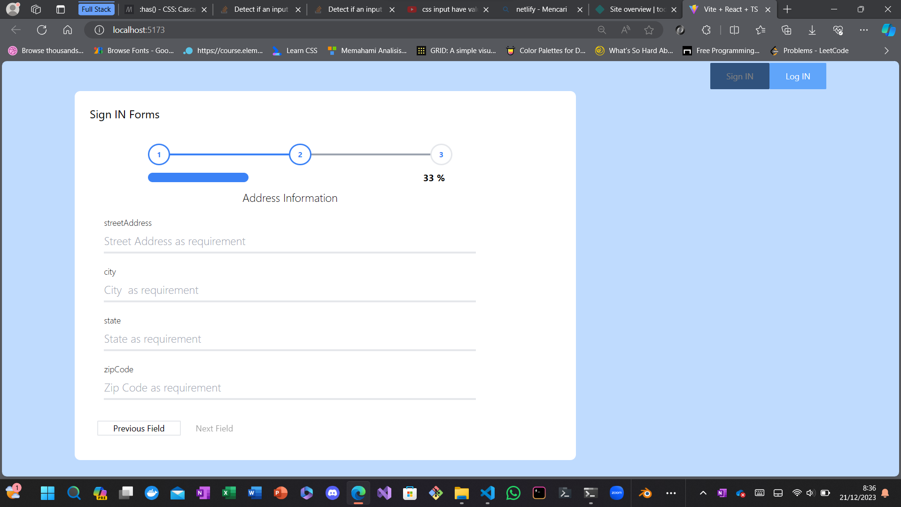
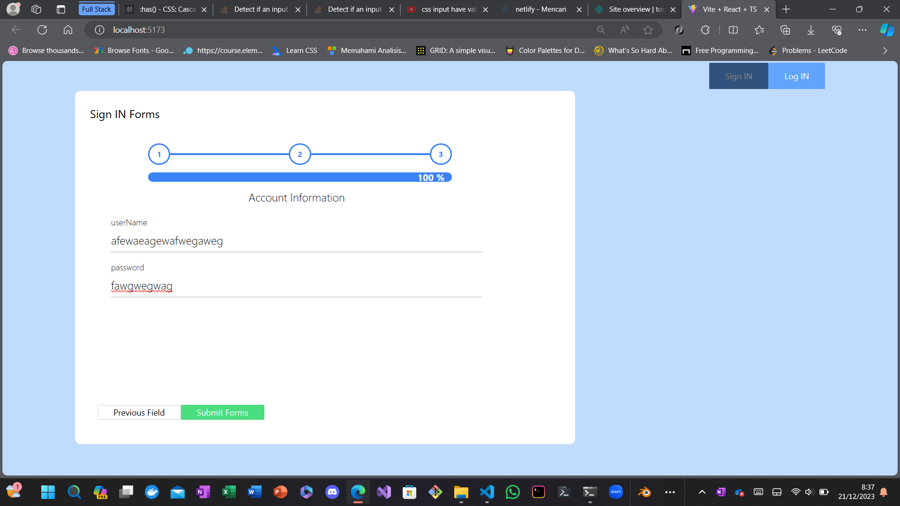

# Read mee 😎😎😎 Simple Forms with react, Formic and tailwind

## [Link to app deployed at netlify ](https://notetodonet.netlify.app/)

### Multi Page forms

### Single Page forms

### Counts forms percentage

### percentage was full

> this forms build with FORMIC forms context handlers and tailwind style class,

https://youtu.be/cchqeWY0Nak?si=hTlJ-9A9R9ocU_rH
